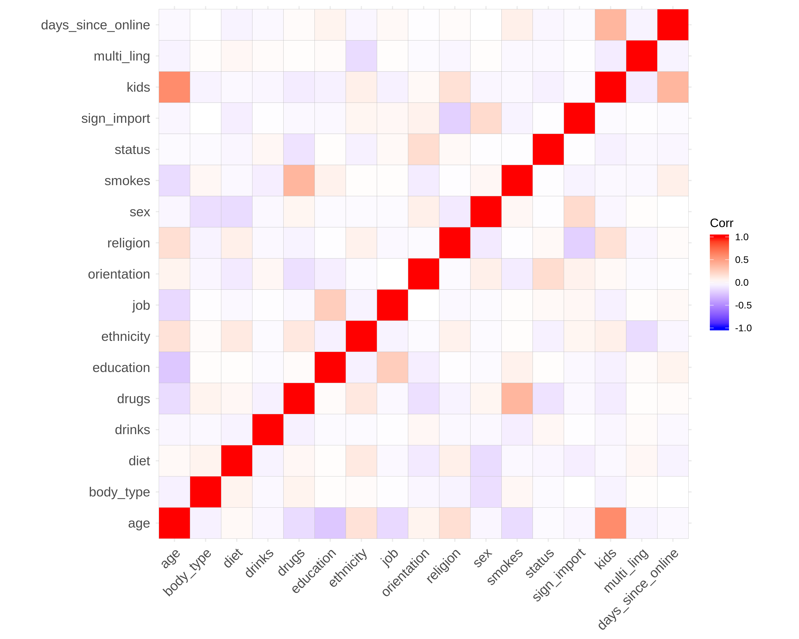
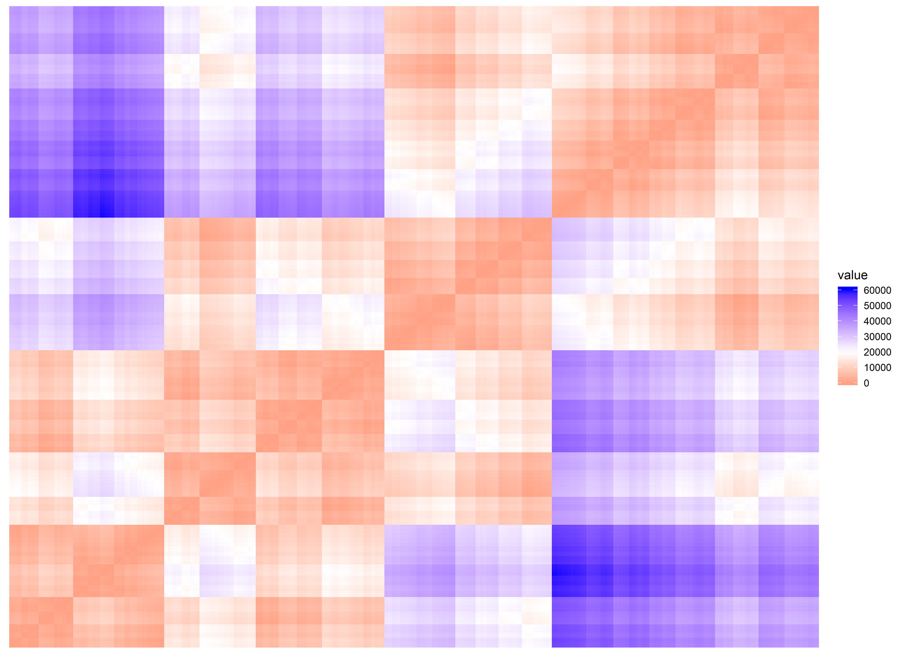
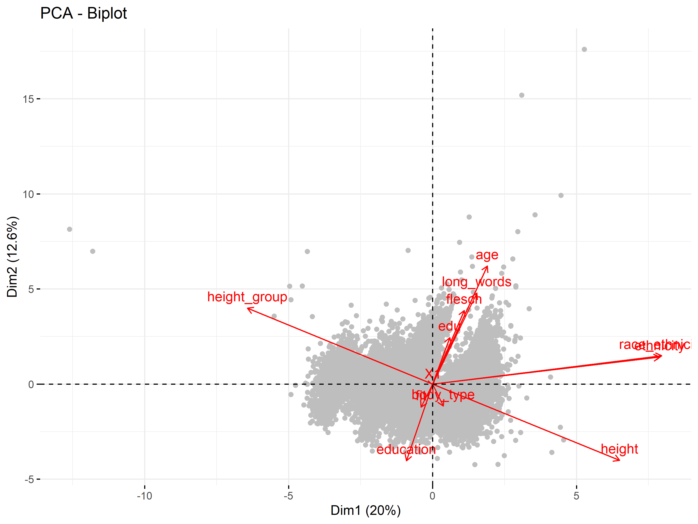
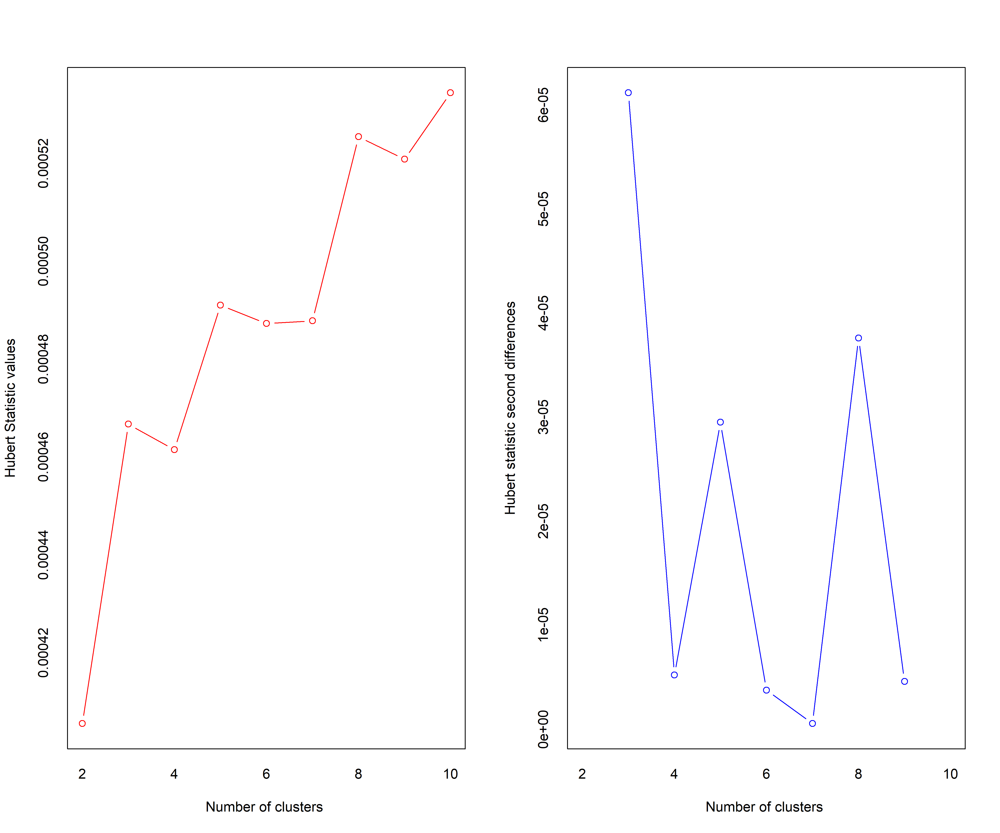
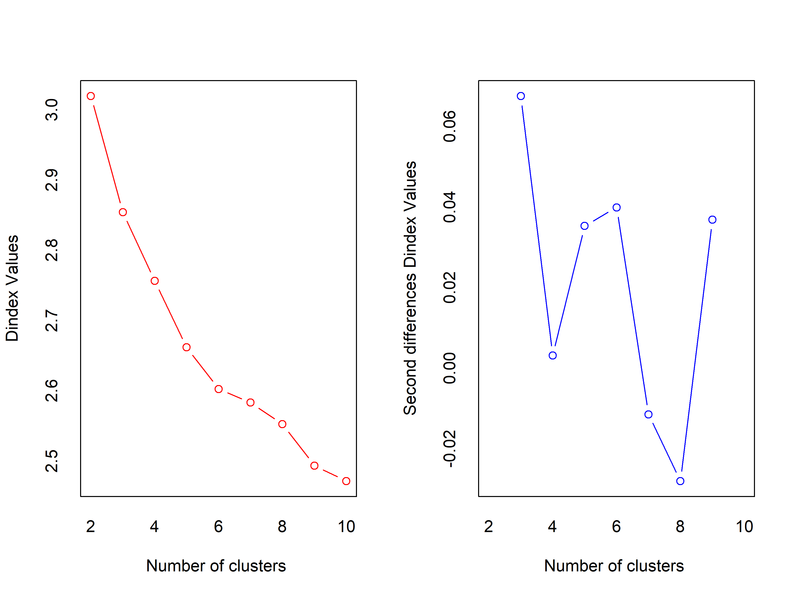
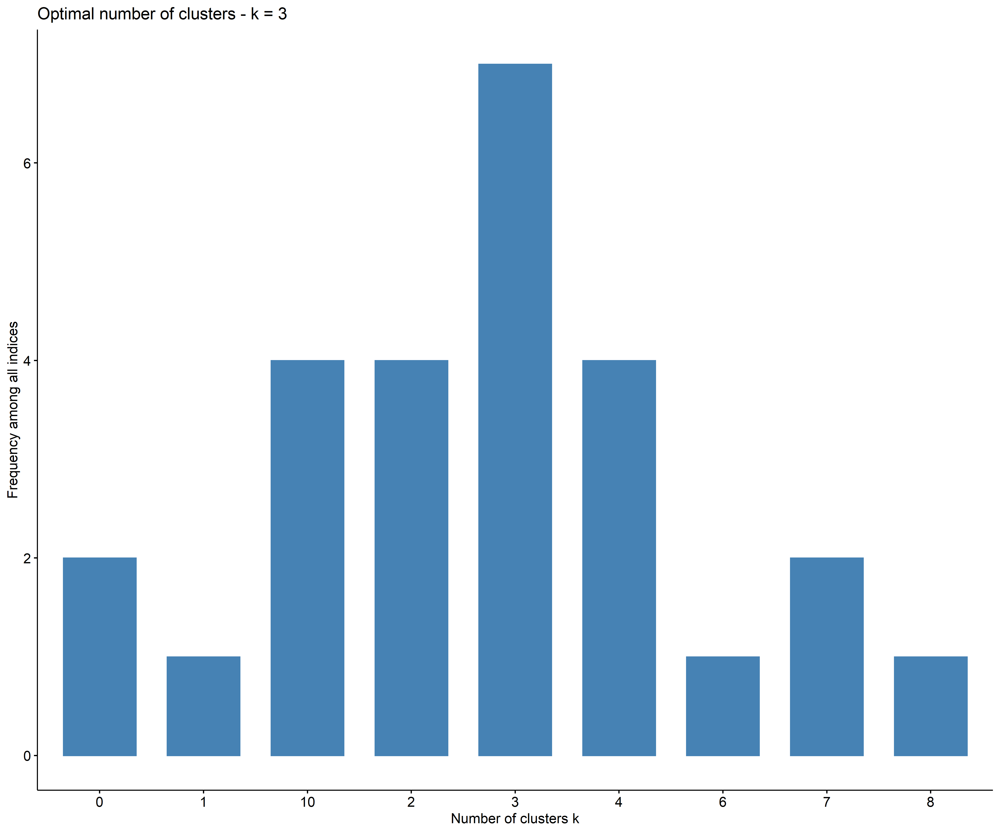
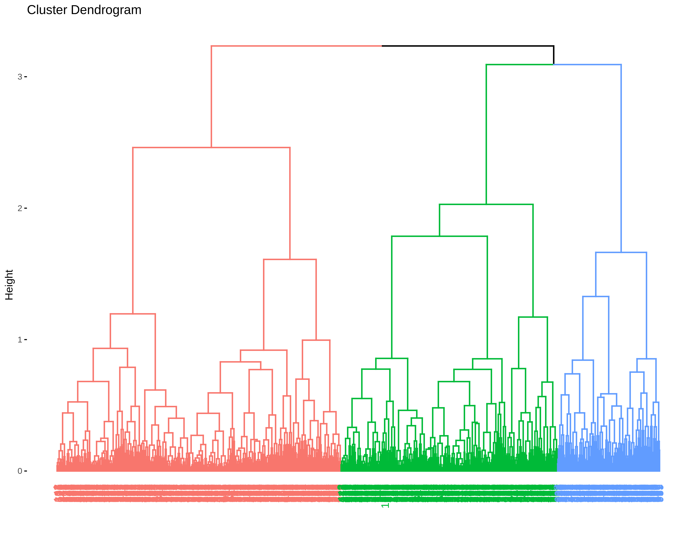
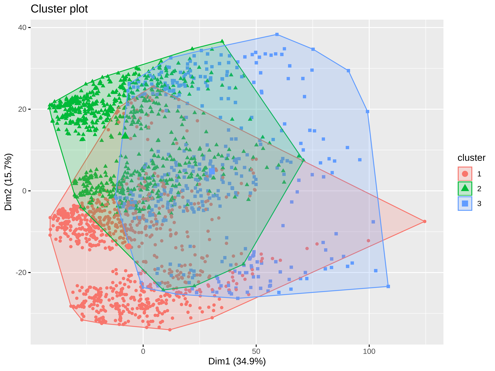

Advanced Clustering
================
Adam Shelton
11/11/2019

## Import Data

``` r
original_data = read_csv(here("Data", "final_okcupid.csv")) %>% select(-c("new_index", "orig_index", "clean_text", "essay9", "long_words", "flesch",  "dbscan_cluster", "profile_length", "prop_longwords" ))
```

    ## Parsed with column specification:
    ## cols(
    ##   new_index = col_double(),
    ##   orig_index = col_double(),
    ##   age = col_double(),
    ##   clean_text = col_character(),
    ##   essay9 = col_character(),
    ##   height = col_double(),
    ##   edu = col_character(),
    ##   fit = col_character(),
    ##   race_ethnicity = col_character(),
    ##   height_group = col_character(),
    ##   long_words = col_double(),
    ##   flesch = col_double(),
    ##   dbscan_cluster = col_double(),
    ##   profile_length = col_double(),
    ##   prop_longwords = col_double()
    ## )

``` r
names(original_data)
```

    ## [1] "age"            "height"         "edu"            "fit"           
    ## [5] "race_ethnicity" "height_group"

## Descriptive Statistics

``` r
skim_list = original_data %>% skim() %>% partition()

skim_list$numeric %>% kable()
```

| skim\_variable | n\_missing | complete\_rate |     mean |       sd | p0 | p25 | p50 | p75 | p100 | hist  |
| :------------- | ---------: | -------------: | -------: | -------: | -: | --: | --: | --: | ---: | :---- |
| age            |          0 |              1 | 32.02280 | 9.090394 | 18 |  26 |  30 |  36 |   69 | ▇▇▂▁▁ |
| height         |          0 |              1 | 70.50816 | 3.034585 |  3 |  69 |  70 |  72 |   95 | ▁▁▁▇▁ |

``` r
skim_list$character%>% kable()
```

| skim\_variable  | n\_missing | complete\_rate | min | max | empty | n\_unique | whitespace |
| :-------------- | ---------: | -------------: | --: | --: | ----: | --------: | ---------: |
| edu             |          0 |              1 |   7 |  21 |     0 |         3 |          0 |
| fit             |          0 |              1 |   3 |   7 |     0 |         3 |          0 |
| race\_ethnicity |          0 |              1 |   5 |   8 |     0 |         6 |          0 |
| height\_group   |          0 |              1 |   5 |   9 |     0 |         2 |          0 |

``` r
original_data %>% mutate_if(is.character, factor) %>% mutate_all(as.numeric) %>% cor(use = "pairwise.complete.obs") %>% ggcorrplot()
```

<!-- -->

``` r
clusterability = original_data %>% mutate_if(is.character, factor) %>% mutate_all(as.numeric) %>% sample_n(5000) %>% get_clust_tendency(n = 50)
clusterability$hopkins_stat
```

    ## [1] 0.9151278

``` r
clusterability$plot
```

<!-- -->

## PCA

``` r
original_data %>% mutate_if(is.character, factor) %>% mutate_all(as.numeric) %>% mutate_all(scale) %>% PCA(graph = FALSE) %>% fviz_pca_biplot(label = "var", col.var = "red", col.ind = "grey")
```

<!-- -->

``` r
ggsave2(here("Clustering", "pca_v2.png"), height = 7, width = 11)
```

## Agglomerative Nesting

``` r
sampled_data = original_data %>% sample_n(5000) 
agnes_data = sampled_data %>% mutate_if(is.character, factor) %>% mutate_all(as.numeric) %>% mutate_all(scale) 
agnes_diss = agnes_data %>% as.matrix() %>% daisy(metric = "gower")
```

    ## Warning in daisy(., metric = "gower"): binary variable(s) 6 treated as interval
    ## scaled

``` r
nb_results = NbClust(data = agnes_data, diss = agnes_diss, distance = NULL, min.nc = 2, max.nc = 10, method = "ward.D2")
```

    ## Warning in log(det(P)/det(W)): NaNs produced

    ## Warning in log(det(P)/det(W)): NaNs produced
    
    ## Warning in log(det(P)/det(W)): NaNs produced
    
    ## Warning in log(det(P)/det(W)): NaNs produced
    
    ## Warning in log(det(P)/det(W)): NaNs produced
    
    ## Warning in log(det(P)/det(W)): NaNs produced
    
    ## Warning in log(det(P)/det(W)): NaNs produced

<!-- -->

    ## *** : The Hubert index is a graphical method of determining the number of clusters.
    ##                 In the plot of Hubert index, we seek a significant knee that corresponds to a 
    ##                 significant increase of the value of the measure i.e the significant peak in Hubert
    ##                 index second differences plot. 
    ## 

<!-- -->

    ## *** : The D index is a graphical method of determining the number of clusters. 
    ##                 In the plot of D index, we seek a significant knee (the significant peak in Dindex
    ##                 second differences plot) that corresponds to a significant increase of the value of
    ##                 the measure. 
    ##  
    ## ******************************************************************* 
    ## * Among all indices:                                                
    ## * 6 proposed 2 as the best number of clusters 
    ## * 4 proposed 3 as the best number of clusters 
    ## * 2 proposed 5 as the best number of clusters 
    ## * 1 proposed 7 as the best number of clusters 
    ## * 4 proposed 8 as the best number of clusters 
    ## * 4 proposed 9 as the best number of clusters 
    ## * 1 proposed 10 as the best number of clusters 
    ## 
    ##                    ***** Conclusion *****                            
    ##  
    ## * According to the majority rule, the best number of clusters is  2 
    ##  
    ##  
    ## *******************************************************************

``` r
fviz_nbclust(nb_results)
```

    ## Among all indices: 
    ## ===================
    ## * 2 proposed  0 as the best number of clusters
    ## * 6 proposed  2 as the best number of clusters
    ## * 4 proposed  3 as the best number of clusters
    ## * 2 proposed  5 as the best number of clusters
    ## * 1 proposed  7 as the best number of clusters
    ## * 4 proposed  8 as the best number of clusters
    ## * 4 proposed  9 as the best number of clusters
    ## * 1 proposed  10 as the best number of clusters
    ## * 2 proposed  NA's as the best number of clusters
    ## 
    ## Conclusion
    ## =========================
    ## * According to the majority rule, the best number of clusters is  2 .

<!-- -->

``` r
agnes_mod = agnes_diss %>% hcut(isdiss = TRUE, k = 2, hc_func = "agnes", hc_method = "ward.D2")
fviz_dend(agnes_mod)
```

<!-- -->

``` r
sampled_data$cluster = agnes_mod$cluster
fviz_cluster(agnes_mod, data = agnes_diss, labelsize = 0)
```

<!-- -->

``` r
saveRDS(sampled_data, here("Data", "Results", "agnes_results.rds"))
write_csv(sampled_data, here("Data", "Results", "agnes_results.csv"))
```

### Cluster Interpretation

``` r
modal = function(vect, percent = FALSE, only_one = FALSE) {
  library(tidyverse)
  modal_val = vect %>% unlist() %>% table() %>% .[. == max(.)] %>% names()
  if (only_one) {
    modal_val = modal_val[1]
  }
  if (percent) {
    return(vect %>% unlist() %>% .[. == modal_val] %>% (function(x) length(x) / length(vect)))
    }
  modal_val
}

cluster_significance = function(var, data, clus_var = "cluster") {
  wilcox.test(as.formula(paste(var, "~", clus_var)), data)$p.value
}

sampled_data %>% select_if(is.numeric) %>% group_by(cluster) %>% summarise_all(mean) %>% kable(caption = "Mean by Cluster")
```

| cluster |      age |   height |
| ------: | -------: | -------: |
|       1 | 31.90394 | 67.46991 |
|       2 | 32.03423 | 72.10147 |

Mean by Cluster

``` r
sampled_data %>% select_if(is.numeric) %>%  {sapply(names(select(., -cluster)), cluster_significance, data = .)} %>% round(3) %>% enframe() %>% kable(caption = "Wilcox Test P-values")
```

| name   | value |
| :----- | ----: |
| age    | 0.536 |
| height | 0.000 |

Wilcox Test P-values

``` r
sampled_data %>% select_if(is.numeric) %>% group_by(cluster) %>% group_by(cluster) %>% summarise_all(sd) %>% kable(caption = "Standard Deviation by Cluster")
```

| cluster |      age |   height |
| ------: | -------: | -------: |
|       1 | 8.786342 | 1.721561 |
|       2 | 9.219564 | 1.968439 |

Standard Deviation by Cluster

``` r
sampled_data %>% select_if(is.numeric) %>% group_by(cluster) %>% group_by(cluster) %>% summarise_all(median) %>% kable(caption = "Median by Cluster")
```

| cluster | age | height |
| ------: | --: | -----: |
|       1 |  30 |     68 |
|       2 |  30 |     72 |

Median by Cluster

``` r
sampled_data %>% mutate(cluster = factor(cluster)) %>% select_if((function(x) !is.numeric(x))) %>% group_by(cluster) %>% summarise_all(modal, only_one = TRUE) %>% kable(caption = "Mode by Cluster")
```

| cluster | edu                   | fit | race\_ethnicity | height\_group |
| :------ | :-------------------- | :-- | :-------------- | :------------ |
| 1       | More than High School | fit | White           | short         |
| 2       | More than High School | fit | White           | not\_short    |

Mode by Cluster

``` r
sampled_data %>% mutate(cluster = factor(cluster)) %>% select_if((function(x) !is.numeric(x))) %>% group_by(cluster) %>% summarise_all(modal, percent = TRUE, only_one = TRUE) %>% mutate_if(is.numeric, round, 3) %>% kable(caption = "Mode by Cluster")
```

| cluster |   edu |   fit | race\_ethnicity | height\_group |
| :------ | ----: | ----: | --------------: | ------------: |
| 1       | 0.707 | 0.549 |           0.477 |             1 |
| 2       | 0.726 | 0.565 |           0.703 |             1 |

Mode by Cluster
