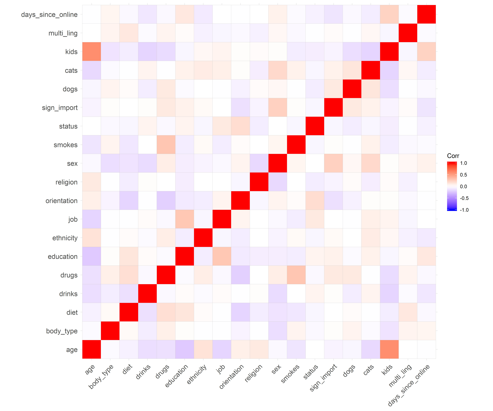

Advanced Clustering
================
Adam Shelton
11/11/2019

## Import Data

``` r
#original_data = readRDS(here("Data", "full_ok_cupid_cleaned.rds"))

new_features = read_csv(here("Data", "newfeatures.csv")) %>% select(-X1) %>% as.matrix() %>% scale()
```

    ## Warning: Missing column names filled in: 'X1' [1]

    ## Parsed with column specification:
    ## cols(
    ##   .default = col_double()
    ## )

    ## See spec(...) for full column specifications.

## PCA

``` r
PCA(new_features, graph = FALSE) %>% fviz_pca_biplot(label = "var", col.var = "red", col.ind = "grey")
```

<!-- -->

``` r
ggsave2(here("Clustering", "pca.png"), height = 7, width = 11)
```

## CLARA

``` r
#nb <- NbClust(new_features, distance = "euclidean", min.nc = 2, max.nc = 10, method = "complete", index ="all")

build_clara = function(x) {
  clara(new_features, x)
}

clara_mods = lapply(1:10, build_clara)

clara_viz = lapply(clara_mods[2:10], fviz_cluster, labelsize = 0)
plot_grid(plotlist = clara_viz)
```

<!-- -->

``` r
ggsave2(here("Clustering", "clara_all.png"), height = 7, width = 11)

clara_viz[[2]]
```

<!-- -->

``` r
ggsave2(here("Clustering", "clara_three.png"), height = 7, width = 11)
```

## Fuzzy

## DBSCAN

``` r
kNNdistplot(new_features, k = ncol(new_features) - 1)
abline(h= 0.5, col = "red", lty=2)
```

<!-- -->

``` r
test = dbscan(new_features, 0.5)

fviz_cluster(test, new_features, labelsize = 0)
```

<!-- -->
