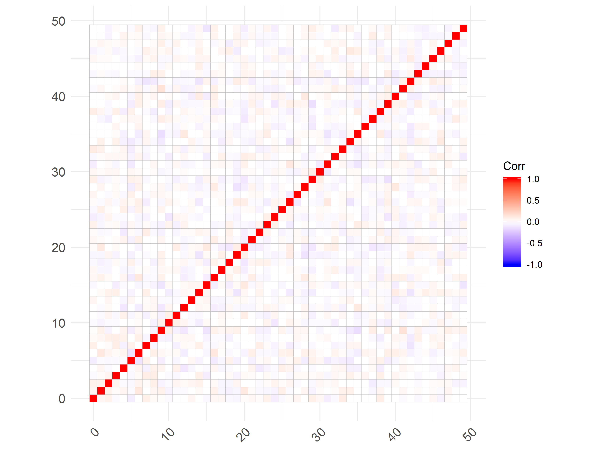
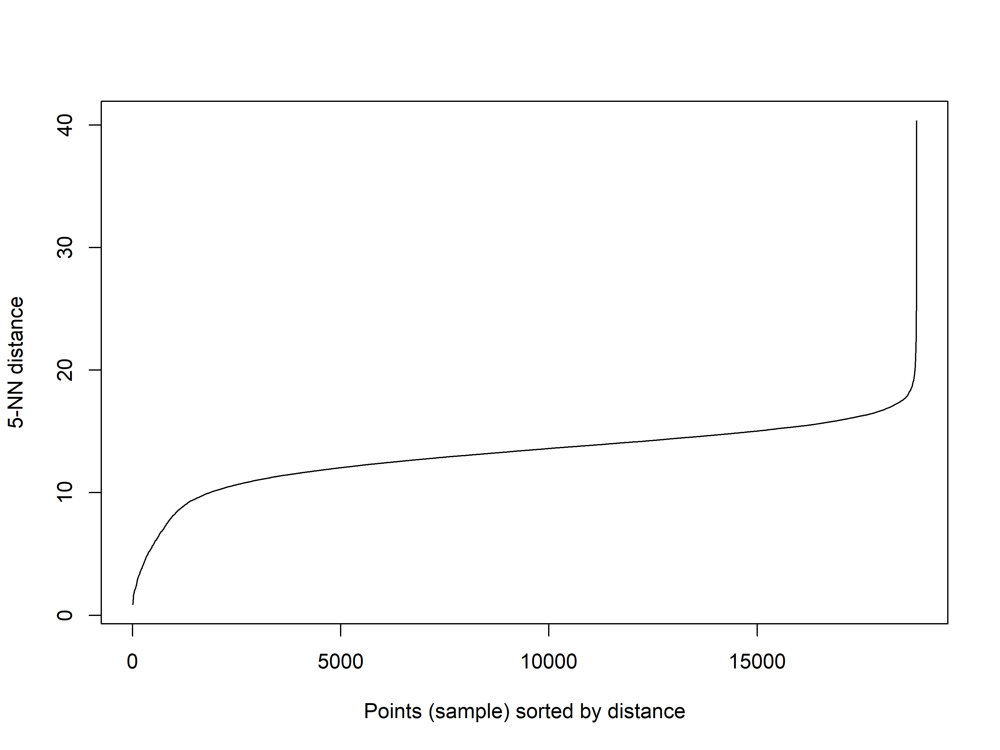
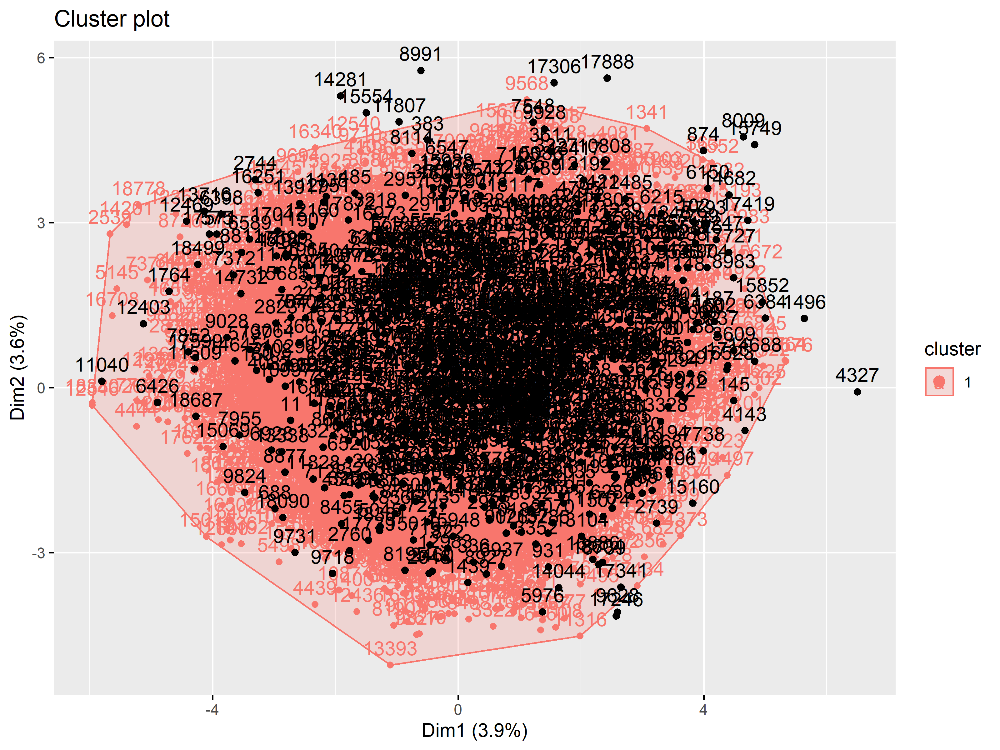
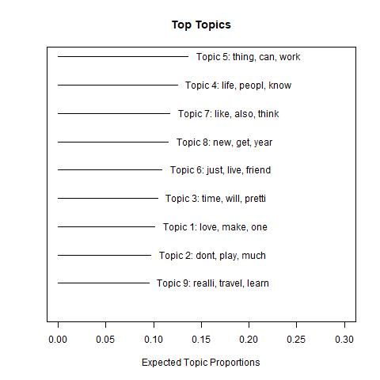
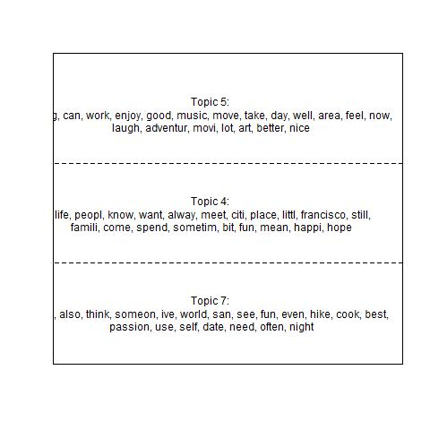
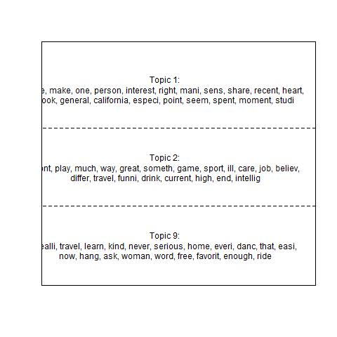
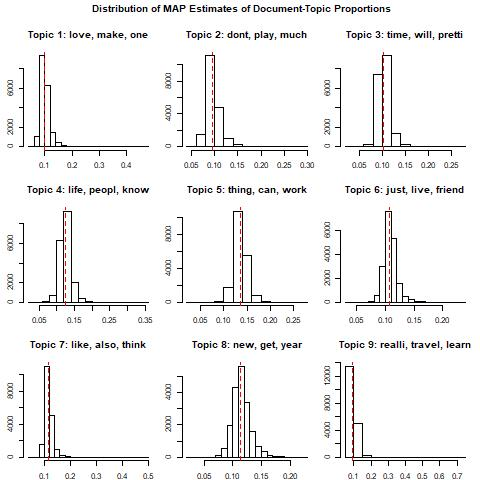
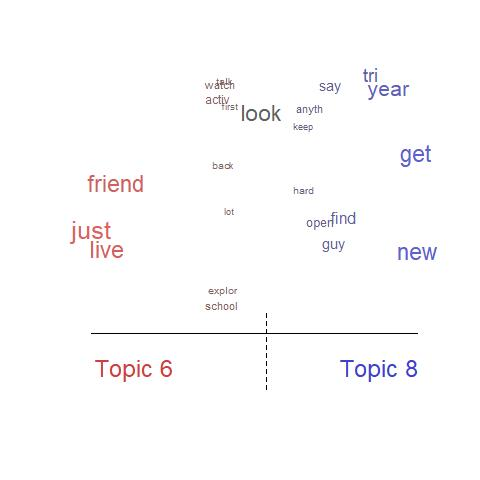
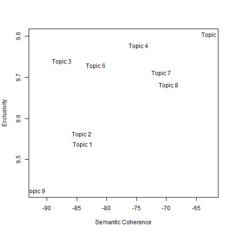
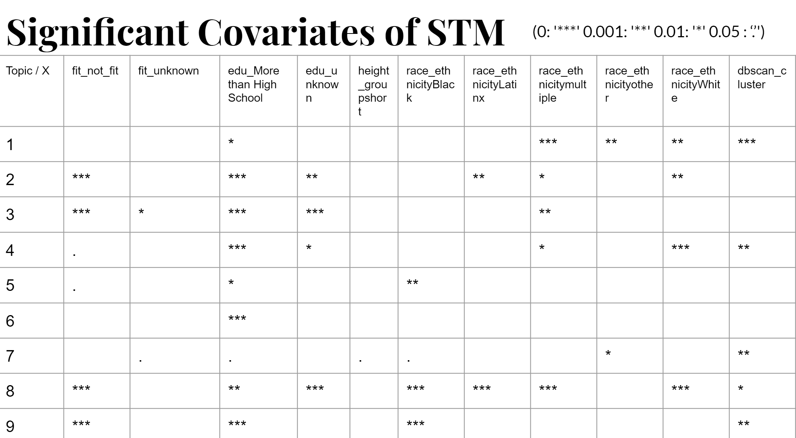

```{r main-setup, include=FALSE}
library(tidyverse)
library(here)
library(knitr)
library(kableExtra)
library(skimr)
library(ggcorrplot)
library(treemapify)
library(factoextra)


#set working directory
#setwd('C:/Users/lliu9/Desktop/UML_Project/unsupervised-dating/Final Report')

knitr::opts_chunk$set(echo = FALSE, warning=FALSE, error = FALSE, message = FALSE , dpi = 400, tidy.opts=list(width.cutoff=50), tidy=TRUE)

# converts a Jupyter notebook to a regular old Python script
flatten_jupyter = function(path_to_notebook) {
  output_path = str_replace(path_to_notebook, ".ipynb", ".py")
  system(paste("python3", "-m", "nbconvert", "--to", "script", paste0("\"", path_to_notebook, "\"")))
  return(output_path)
}
```

# Contributions
```{r contrib, echo=FALSE}
tibble(Liu = c("KMeans", "Structural Topic Modeling", "Volunteer for the App Demo"), Pandit = c("Item 1", "Item 2", "Item 3"), Shelton = c("EDA", "AGNES", "DBSCAN")) %>% kable() %>% kable_styling() %>% row_spec(0, bold = TRUE)
```

\newpage
# Introduction

“So tell me about yourself!’’ This seemingly straightforward question in day-to-day interactions is usually met with silence and hesitation. That can no longer be the case for the 1.67 trillion online dating industry, which has grown exponentially in popularity over the last decade. The dating apps, such as OkCupid and Coffee Meets Bagel, are designed to help the singles ‘get to know’ other people for short or long-term romantic relationships. In order to be popular and memorable, users usually have to write a short introduction to advertise themselves. Such activity could be regarded as self-marketing. As the users of dating apps come from diverse backgrounds, we are interested in how users from distinct backgrounds take different approaches to make themselves more memorable. Moreover, we design the framework of scoring users’ self-introduction and algorithm for providing writing tips (such as words for being memorable). Although our project is still preliminary, it has gained a lot of interest among our friends who struggle to find a date online. Also, our methods and analysis have the potential to be adopted by the dating website to improve the users’ experience and better achieve their mission as matchmakers. 

# Literature Review

Self-concept and self-representation have long served as grounds of debate in cognitive and positive psychology [@bruning1999cognitive] as well as social anthropology [@goffman1975presentation]. The recent spread of social networking and its specific affordances have allowed individuals to build different online ‘selves’ [@papacharissi2010networked]. One such critical scenario may be that of mate selection, which several economists and sociologists have likened this to ‘marriage marketplace’ [@hitsch2010matching]. Several online dating service providers in developed countries may facilitate the expansion of potential mates beyond the limits of even extended offline social networks @cacioppo2013marital assert that as many as one in three marriages in the United States is facilitated through these portals. @heino2010relationshopping argue that these avenues further entrench the economic dimension through an acute, implicit awareness of ‘relationshopping’. Herein, potential partners are reduced to entries in a catalog to be scrolled through. In this sense, they suggest an emerging conscientiousness of ‘marketing’, with the product being themselves, and the potential mate assuming the role of a buyer (ibid). This perception thus links the private worlds of romantic intimacy with those of mass consumption and broader perceived appeal to the opposite sex. 

Potentially, we will also use some marketing theories to understand our findings. Selling themselves and finding a mate on OkCupid is not very different from selling a product on eBay. Economists have been interested in the matching problem of demand and supply, such as @hitsch2010matching. Since we do not have data on users’ interactions, we will focus primarily on understanding how people brand themselves to stand out in a crowd. For example, brand awareness is a key metric in marketing to quantify the degree to which people recall or recognize a brand. A high level of brand awareness helps a product stand out and get chosen when consumers face many alternatives. 

This could be applied to understand online dating. Let us imagine your future mate uses the filter to narrow down the consideration sets. He/She might still face many similar choices with high matching scores to choose from. If you want to stand out from the pool, you must make yourself memorable by highlighting the uniqueness. Thus, one possible idea in this project is to explore and understand how users could increase their brand awareness and differentiate themselves in their segments

# Empirical Strategy

This project will leverage a publicly open and anonymized user profile data from OkCupid. In particular, we will use several key demographic variables and the self-introduction text. Also, we currently focus on only male users as generally male users face more competition among peers.


Firstly, we use different cluster analysis to group the users. We would expect users with similar backgrounds to introduce themselves in a similar manner. Since the demographic variables are mostly categorical with many levels and we use the Gowler distance, including them all would be computationally impossible. Instead, we rely on the literature on selecting the four most interesting variables and also apply other techniques to generate new features from the self-introductions.

Secondly, we use topic modeling (LDA) to visualize the latent topics behind the text. We also compare the differences in topic propotions for different groups and clusters of users.

Thirdly, we use the structural topic modeling to estimate the impact of the demographic variables and humor measure (DBScan on Doc2Vec vectors) on the topic proportions. 

Lastly, we discuss the potential use of our analysis and also acknowledge the challenges and limitations we face at this stage.

# Analysis & Results

## Exploratory Data Analysis

### Descriptive Statistics

```{r descr-stats-demo, echo=FALSE, cache=TRUE}
original_data = read_csv(here("Data", "final_okcupid.csv"))
skim_list = original_data %>% select(-c(dbscan_cluster, new_index, orig_index)) %>% skim() %>% partition()

skim_list$numeric %>% select(-hist) %>% mutate_if(is.numeric, round, digits = 2) %>% kable(caption = "Continuous Variables")
skim_list$character%>% kable(caption = "Other Variables")

original_data %>% select(-c(orig_index, new_index, clean_text, essay9, dbscan_cluster)) %>% select_if(is.numeric) %>% cor(use = "pairwise.complete.obs") %>% ggcorrplot() + labs(title = "Correlation Plot of Demographic Variables")
```

The data we used was approximately 60,000 anonymous OkCupid profiles from 2012 that were gathered with consent from users in the San Francisco area [@kim2015okcupid]. This data was downloaded from the GitHub page for @kim2015okcupid, [https://github.com/rudeboybert/JSE_OkCupid](https://github.com/rudeboybert/JSE_OkCupid). The data contains demographic attributes of users that were submitted to their profile, including variables like age, height, race, and education, in addition to a selection of ten short essays that users have written in response to different prompts to display on their profiles. We subsetted this data to `r nrow(original_data)` profiles of men, and generated additional features for the numbers and proportions of long words and Flesch–Kincaid readability scores of the main profile essay. The majority of male users in our sample or white, fit, not-short, and have more than a high school education. The mean reported age is 32 and the mean reported height is 70.5 inches (approximately 5 foot 9 inches).

The majority of the variables included in the demographic data are independent, but some weaker correlations do exist. As expected there are positive correlations between all the features generated from the essay text. Age is also positively correlated with our text-generated features, perhaps suggesting that older people are more educated and write with more complexity. While Flesch scores and the amount of long words are correlated, there do not appear to be any demographic interactions with that relationship.

```{r viz-analysis, echo=FALSE, cache=TRUE}
original_data %>% 
  select(edu, fit, height_group, race_ethnicity) %>% 
  mutate_all(factor) %>% 
  pivot_longer(dplyr::everything()) %>% 
  table() %>% 
  as_tibble() %>% 
  ggplot(aes(area = n, fill = value, label = value)) + 
  geom_treemap() + 
  geom_treemap_text(color = "white", place = "centre", grow = TRUE) + 
  facet_wrap(~ name) + theme(legend.position = "none") + 
  labs(title = "Categorical Variable Distributions")

original_data %>% select(-new_index, -orig_index, -age, -height, -clean_text, -essay9, -dbscan_cluster, -profile_length, -prop_longwords) %>% pivot_longer(-c(flesch, long_words)) %>% ggplot(aes(x = log(flesch + abs(min(flesch)) + 1), y = long_words, color = value)) + geom_point(alpha = 0.3, size = 1) + facet_wrap(~ name) + theme(legend.position = "none") + labs(title = "Flesch score vs. Long words by Variable", x = "Flesch Score (log)", y = "Number of Long Words")
```


### Clusterability

```{r demo-clusterability, cache=TRUE}
clusterability = original_data %>% select(-c(new_index, orig_index, clean_text, essay9, dbscan_cluster)) %>% mutate_if(is.character, factor) %>% mutate_all(as.numeric) %>% sample_n(2000) %>% scale() %>% get_clust_tendency(n = 10)
clusterability$plot
```
The demographic data is highly clusterable with a Hopkins Statistic of `r round(clusterability$hopkins, 3)` on a random subset of 2,000 observations. The ordered dissimilarity image not only provides visual evidence of this clusterability, but also gives some indication of how many clusters may be in this data. Unfortuantely, clusterability could not be determined for the whole dataset due to performance limitations. However, 2,000 observations should be sufficient for determining clusterability. 

## Clustering of Demographic Data

### K-means

Kmeans is a type of partitioning clustering algorithm to maximize intra-cluster homogeneity and maximize inter-cluster heterogeneity. We use four demographic variables: 'fit', 'education', 'height_group', 'race_ethnicity' as previous research shows evidence these four variables are associated with users' different behavior in online self-introductions. We use Gower's distance as these variables are categorical. We start with 3 clusters and plot with the `fviz_cluster` function.


Then we find the optimal number of clusters by comparing the metric of average silhouette width. However, the metric does not converge and keeps growing with more clusters. As a result, kmeans is not the best for finding the optimal demographic clusters.

### AGNES

Agglomerative Nesting was used to cluster the demographic data with a bottom-up approach to contrast the K-means clustering. As an AGNES model would not complete on the full data-set, a random subset of 5,000 observations was used instead. This AGNES model used a Gower's dissimilarity matrix of the data to aid in the clustering of categorical variables, since most of the demographic variables are categorical. Using the `NbClust` package in R, we determined that the optimal number of clusters was two, when using the `ward.D2` method to match our AGNES model. The model gives us two well-defined clusters along the first two principal components. The defining factor between these two clusters, majorly appears to be height, which, per the Wilcox Test, has a statistically significant difference between the means of the two clusters by about five inches. These AGNES clusters can be used to reduce demensionality among a user's demographics so it can be more effectively used in further analyses. The dendrogram and cluster plots were generated using the `factoextra` package in R.


## Text Analysis

### Word2Vec

### Topic Modeling

A topic is defined as a mixture of words where each word has a probability of generating from a topic. The example would be words such as 'books', 'college', 'MOOC' could come from the topic of study. A document is a mixture of topics, where a single document can have covered multiple topics. The example would be that a user talks about topics related to career, study, hobbies, and religion in the self-introduction.

We start the topic modeling by using the nonnegative matrix factorization (NMF). It is sometimes preferred to Latent Dirichlet allocation (LDA) as it is a deterministic algorithm and assumes that topic probabilities have to be fixed per self-introduction. Also, it is easy to implement with the `gensim` package in Python as we have prior experience with it. We train the NMF topic model with 25 latent topics and then further visualize the proportions of users who use each of the 25 topics most. We also compare the proportions across different levels in the 4 chosen demographic variables.   


However, although the plots suggest some differences, we don't know if they are statistically significant and also cannot quantify its association with the topic proportions. 

As a result, we return to the LDA approach. We choose the topics based on semantic coherence scores. 


The plot above suggests 25 topics yields the highest score, but 9 topics yields a good score as well. So we further calculate perplexity , which is regarded as the model's "surprise" at the data. The perplexities are 3261and 3265 for 9 and 25 topics, respectively. Thus, we fix 9 topics for the following analysis.

Next, we fit a LDA topic model with 9 topics where each document is labeled with cluster number (1, 2, 3). 


This plot shows that for Cluster 1, almost all topics are associated with the common words  such as "life, time, friends". This result is somewhat discouraging as we cannot draw any insights from it. The topic proportion plots are almost identical for Cluster 2 and Cluster 3.


### DBSCAN

As we wanted to determine factors behind why a profile might stick out, we decided to use 
a DBSCAN model was used to detect outliers within a data-set of 50 vectors calculated by Doc2Vec. As Doc2Vec vectors capture different characteristics about the text, any outliers in these vectors should be profiles that deviate from the norm to some degree. As shown below, these Doc2Vec vectors are highly independent with very few correlations, but also highly clusterable, with a Hopkins Statistic of 0.808.



Using a K-nearest-neighbors distribution plot, we determined that the optimal value for the epsilon neighborhood size of the DBSCAN model was 9. This was determined using 5 nearest neighbors, to match the default minimum number of points in the epsilon region, which we used for the model.



The DBSCAN model identified one cluster, and 108 outliers, accounting for 0.57% of the observations. Using a Wilcox Test, we can determine that the difference in the means between the "typical" profiles and outlier profiles are insignificant for the continuous variables for height and number of long words, but are highly significant for Flesch score and age. Mean age is higher among the outliers by about 4.5 years, while the mean Flesch score of outliers is about 8 points higher. This suggests that the outliers, being older and writing at a more advanced level, might be more educated (or at least trying to appear so) than their "typical" peers.




## Structural Topic Modeling

### Motivation

So far, we have explored the patterns within the demographic variables using clustering and self-introduction text using LDA. However, in order to quantify whether people of different backgrounds write different topics, we need to model the topic distributions as a function of the metadata (demographic variables and DBScan score). The structural topic modeling (STM) solves the problem as it allows us to estimate the relationships between topic proportions and document metadata. Similar to the Latent Dirichlet Allocation model, STM also assumes there are some latent document-topic and topic-word distributions generating documents. However, STM differs from LDA as it handles the document-associated metadata. As a result, STM allows us to predict how topical prevalence (proportion of a topic across multiple documents) or topic content (the topic composition of terms) would shift when the metadata changes. 

### Estimation

We use the `stm` R package to estimate the model, summarize results, and visualize with the word cloud and topic network. In our project, we are interested in the topical prevalence. So the response (dependent variable) is the proportion of a topic across multiple self-introductions. The metadata (independent variables) is 'fit', 'education', 'height_group', 'race_ethnicity', and 'dbscan_cluster'. 

In the preparation step, we use `textProcessor` function to stem the words and remove stopwords. Then we use `prepDocuments` function to structure and index the data. As the low-frequency words are probably the more memorable ones, we set the 'lower.thresh' option to 0 to keep all words. 

Then we estimate the model for the topic prevalence using 9 topic models. During the estimation, the proportions of 9 topics are regressed on the metadata. There are many ways to visualize the results. The following plot shows the expected topic proportions 



The proportions across 9 topics do not have a large gap, as the most common topic is 0.14 and the least common one is 0.10. We observe that the top three topics seem to consist of common nouns and verbs that are not very memorable. So we further explore the most frequent words in the model for both the most common topics (#5, #4, and #7) and the least common topics (#1, #2, and #9). 

 

Although it's hard to tell the quantified difference, we find the words in the least common topics are a little more memorable, such as 'intelligent' and 'dance'. 

When we plot the histograms of topics, we find that most of the topics consist of around 10% of the topics of the documents. Interestingly, the histograms of topics #6 and #8 seem to have a bell-curve shape, which suggests there are many documents have higher or lower proportions of 10%. 
 

In particular, we plot these two plots on the same line. Topic #6 is about 'friend' and 'live' and topic #8 is about 'year' and 'get'. So our interpretation is that topic #6 s about casually looking for friends while topic #8 is about setting a goal of getting something new in the year. As a result, although most users talk about them explicitly, some talk them more and some use other expressions.
 

Also, `topicCorr()` calculates correlations between topics, where positive correlations mean that both topics are likely to be discussed within a document.


For the OkCupid beginners, it will be helpful if they could learn what topics are they expected to write together. However, this would only make an ordinary self-introduction. To make it really memorable and stand out, they should consider writing a few topics that are unique and quirky.


### Evaluation

To further understand whether the topics make sense, we use the topicQuality() function to plot the semantic coherence and exclusivity values associated with each topic.

 

The results seem to highly correlated with the topic proportions, as topics with higher proportions also have higher semantic coherence and exclusivity values.

### Effect

Finally, we use `estimateEffect()` function to estimating relationships between metadata and topic prevalence. There are 9 regressions under the hood and 12 coefficients associated with each. To effectively analyze the results with 108 coefficients, we compile them into a table by indicating the coefficients which are statistically significant at the level of 5%. These significant coefficients suggest that we can reject the null hypothesis and accept the alternative hypothesis that a relationship exists between the topic prevalence and metadata.

 

We observe from the table that the factor "edu_More than HIgh Schoo" is significant at all of the 9 regressions. This means that being more educated is associated with some variations in the topic proportions. Intuitively, this suggests more educated people might want to write certain topics that make them memorized as intelligent and knowledgable. 

We notice 'height_groupshort' is only significant for regression #7. Topic # 7 has high probability words such as "like, also, think, someone", which seems quite ordinary. It's likely the use of 'also' indicates they are disconfident when introducing themselves, which might because they feel they are too short.

When looking at the coefficients at each regression, we are surprised that in the regression #6, only edu_More than HIgh Schoo" matters for Topic #6's proportions. In comparison, 8 out of the 11 coefficients are significant in the regression #8. Our current understanding is that for topic#8, people with different backgrounds have various ideas of how much to write about it. 

In summary, we get some interesting results during our first time using structural topic modeling. Although we are still learning it, we believe it has great potential to undercover the underlying relationships between metadata and topic prevalence. Such relationships would be useful for OkCupid to provide users with writing tips to make their self-introduction more memorable.


## Output


The above three pictures show the protocol of the final product that we have in mind. The protocol uses the example of Li (one of the project members), although the information is hypothetical. The first picture displays his demographic information and a short self-introduction. The second picture shows that the new algorithm highlights the common and memorable words by comparing them with the frequencies among his peers. He also gets a score of 63 and some tips on improving the writing. The third picture is the revised version of previous writing, which now Li has a memorable self-introduction with an increased score of 87. He should be confident to reach out to other users on OkCupid now. 


## Discussion

The data of this project has several limitations at this stage. Firstly, without data on the outcome (such as the number of messages), we do not know have a relative measure for the self-introductions' memorabilities. As a result, we don't have the outcomes to train the scoring function with machine learning. Secondly, without follow-up interviews, we cannot measure whether the specific choice of words was aimed at authenticity or matches with an awareness of 'relationshopping' (experienced users use certain phrases fraudulently to hook others). Thirdly, without the users' other profile images, we cannot estimate the effect of a memorable self-introduction on outcomes as the quality of images is a potential moderating variable.


One important issue of applying the structural topic modeling is overfitting, especially when we have a  large number of covariates. We tried to measure the model's accuracy by residual sum of squares on both training set and testing test. However, at this point, we haven't figured out how to predict the new topic prevalences for the testing set. Also there are many remaining questions for this to work. For example, should we measure the accuracy by the average of 9 RSSs? If we use Lasso regression to select a subset of covariates, how should we make the interpretation as there could be different covariates in 9 regressions?


# Conclusion

In this project, we apply different unsupervised machine learning methods learned from class, especially clustering and text mining. Although we have got some interesting results, we realize that there are many other alternative methods that are potentially helpful, such as factor model and association rule mining. A factor analysis may be useful for future analysis as the variables driving choice of words- such as cognitive skills, cultural attitudes, personality traits are likely to be latent and unobservable factors. Association rule mining would further discover the interesting associations within people's demographics or find certain phrases in self-introductions that often occur together.

Lastly, we want to express our excitement for learning these useful tools from the UML class. Also we would like to thank you Dr. Waggoner and our classmates for providing valuable feedback during the two rounds of presentation. This experience greatly arises our interest to study more UML methods in the future.


\newpage
# Appendices

## Kmeans Code

```{r code = readLines(knitr::purl(here("Clustering", "Kmeans.Rmd"), documentation = 1)), echo = T, eval = F}

```

## AGNES Code

```{r code = readLines(knitr::purl(here("Clustering", "advanced_clustering.Rmd"), documentation = 1)), echo = T, eval = F}

```

## DBSCAN Code

```{r code = readLines(knitr::purl(here("Clustering", "dbscan_doc2vec.Rmd"), documentation = 1)), echo = T, eval = F}

```

## Doc2Vec Code

```{python code = readLines(flatten_jupyter(here("Vector_Space_Model", "Doc2Vec_Modelling.ipynb"))), echo = T, eval = F}

```

## Data Filtering Code

```{python code = readLines(flatten_jupyter(here("Vector_Space_Model", "Data_Filter.ipynb"))), echo = T, eval = F}

```

## Structural topic modeling Code

```{r code = readLines(knitr::purl(here("Structural Topic Models", "stm-demo+dbscan.Rmd"), documentation = 1)), echo = T, eval = F}

```


\newpage
# References
